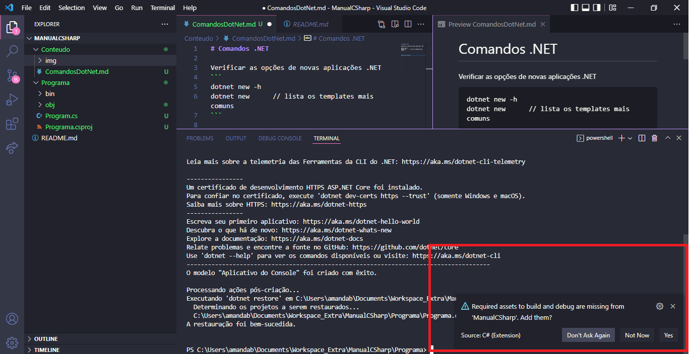
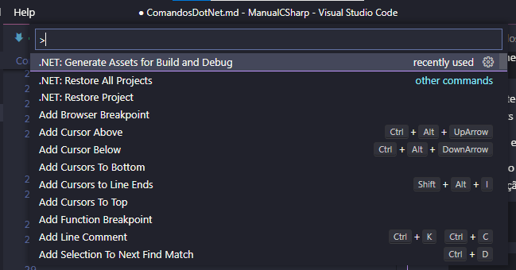
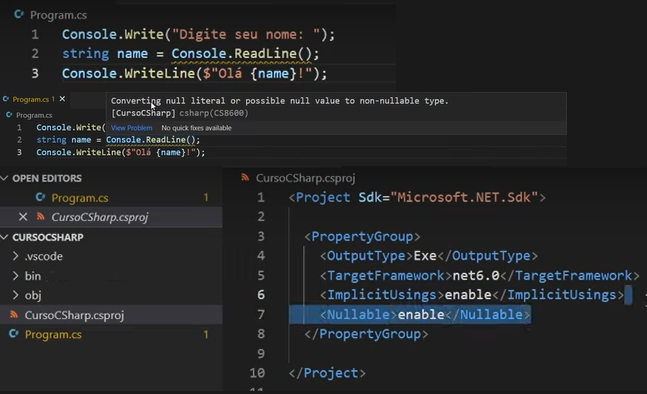

# Comandos .NET

No VS Code, instalar as seguintes extensões
> Name: C#
> Id: ms-dotnettools.csharp
> VS Marketplace Link: https://marketplace.visualstudio.com/items?itemName=ms-dotnettools.csharp

> Name: C# Extensions
> Id: jchannon.csharpextensions
> VS Marketplace Link: https://marketplace.visualstudio.com/items?itemName=jchannon.csharpextensions


Verificar as opções de novas aplicações .NET
```
dotnet new -h
dotnet new      // lista os templates mais comuns
```

Criar uma aplicação .NET usando o template de uma aplicação console
```
dotnet new console
```

Devido à extensão instalada, o VS Code sugere a inclusão de alguns assets para construção e debug (aceite!)



Caso a opção não apareça, aperte "Ctrl+Shift+P" e selecione a seguinte opção




Para rodar a aplicação
```
dotnet run
```


## Nullables em projeto

Por vezes, o 'Console.ReadLine()' pode apresentar um alerta indicando que o valor atribuído poderá ser nulo.
Para desabilitar este aviso, basta ir às configurações de programa e desabilitar a linha correspondente.




## Top level statements

```C#

class Program
{
    static void Main()
    {
        Console.WriteLine("e o programa principal vai aqui!");
    }
}

```

## Gerando o executável da aplicação

console
```
dotnet publish
```