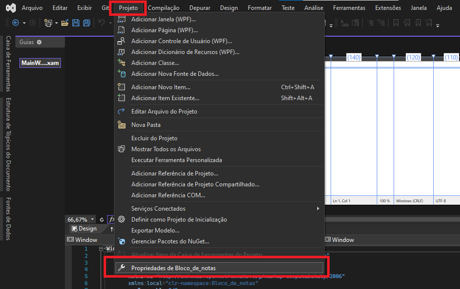
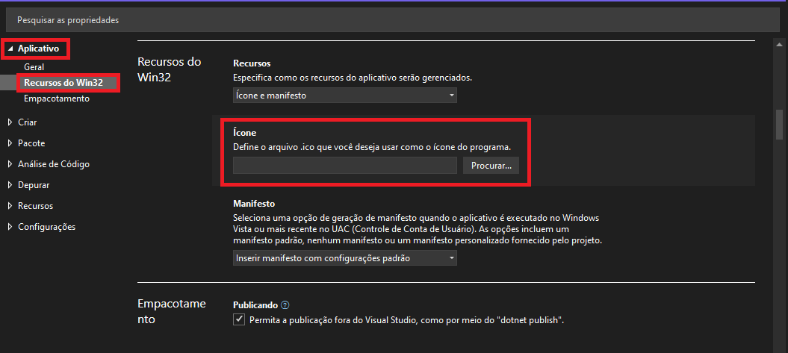
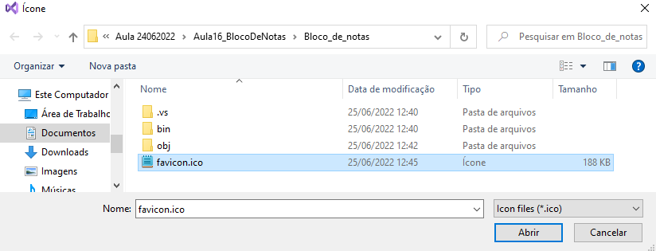
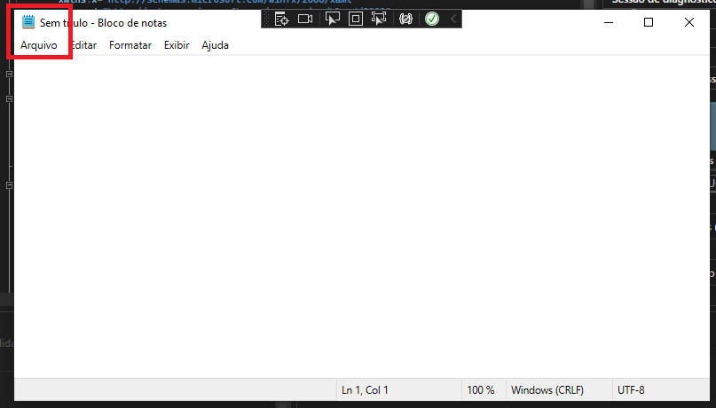

# WPF

## Ícone da aplicação

1. Com a sua aplicação aberta, vá até a guia 'Projeto' e selecione o item 'Propriedades' do seu projeto.



2. Na opção "Aplicativo", vá até "Recursos do Win32", "Ícone" e clique em procurar.



3. Escolha o ícone, que deve ser colocado na pasta da sua aplicação





> **Note**
> 
> Nesse exemplo, o arquivo foi colocado diretamente na pasta do projeto, então não foi necessário informar nenhum caminho relativo ou absoluto, mas caso necessário, poderíamos utilizar o atributo `Icon` para informar a localização do arquivo utilizado.

```html
<Window x:Class="SetIcon.MainWindow"
        xmlns="http://schemas.microsoft.com/winfx/2006/xaml/presentation"
        xmlns:x="http://schemas.microsoft.com/winfx/2006/xaml"
        Icon="favicon.png"
        Title="MainWindow"
        Height="350" Width="525">
    <Grid>
         
    </Grid>
</Window>
```


## Menu

### [ WPF - Criando um menus em tempo de projeto](https://www.macoratti.net/11/03/wpf_mn2.htm)

* **`<Menu>` cria um controle Menu**

Propriedades
- Name: nome do controle
- Height
- Width definem a altura e largura do mesmo.
- Margin
- HorizontalAlignment
- VerticalAlignment
- Background: definir uma cor de fundo para o controle


```html
<Menu 
    Height="22" 
    Name="menu1" 
    Width="200" 
    Margin="10, 10, 5, 5" HorizontalAlignment="Left" VerticalAlignment="Top" 
    Background="Black"
> 
</Menu> 
```

* **`<MenuItem>` inclui itens e sub-itens de menu**

Um MenuItem pode ter outras tags MenuItem aninhadas em diversos níveis.
As tags MenuItem devem estar contidas na tag Menu.

Propriedades:
- Header: define o nome o item de menu
- Background

```html
<MenuItem Header="_Arquivo">
   <MenuItem Header="_Abrir" Background="Yellow"/>
   <MenuItem Header="_Fechar" Background="Blue"/>
   <MenuItem Header="_Salvar" Background="Orange"/>
</MenuItem> 
```

* **`<Separator/>` separa os itens do menu em categorias (linha divisória)**

```html
   <Separator />
       <MenuItem Header="_Textos" Background="Black" Foreground="Coral" >
          <MenuItem Header="_Criar"/>
          <MenuItem Header="_Excluir" />
       </MenuItem>
  <Separator />
```

* **`Tooltip` inclui uma dica ao item de menu**

Usamos a tag MenuItem.Tooltip e no seu interior a tag Tooltip:

```html
<MenuItem Header="_Abrir" Background="Yellow"> 
    <MenuItem.ToolTip> 
        <ToolTip> 
             Abrir um arquivo. 
        </ToolTip> 
    </MenuItem.ToolTip> 
</MenuItem> 
```

* **`IsCheckable="true` inclui uma caixa de verificação (CheckBox) a um item de menu**


```html
<MenuItem IsCheckable="true"> 
```

* **`InputGestureText` inclui um atalho de teclado a um item de menu**


```html
<MenuItem IsCheckable="true" Header="_Novo" InputGestureText="Ctrl+N">  
```

* **`<MenuItem.Icon>` e `<Image/>` uma imagem a frente do item de menu**

```html
<MenuItem Header="_Sair >
    <MenuItem.Icon>
        <Image Source="Teste.jpg" Width="20" Height="20" />
    </MenuItem.Icon>
</MenuItem>
```
